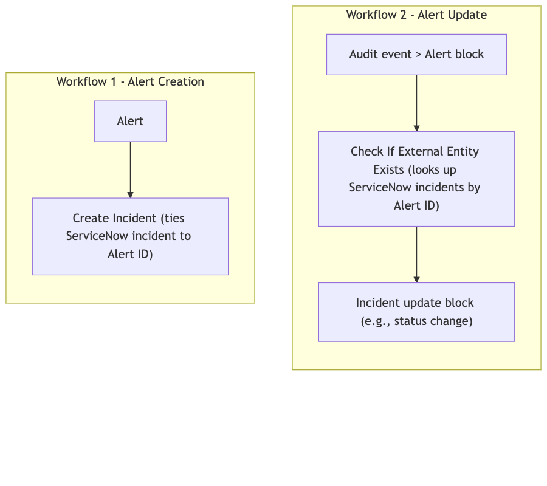
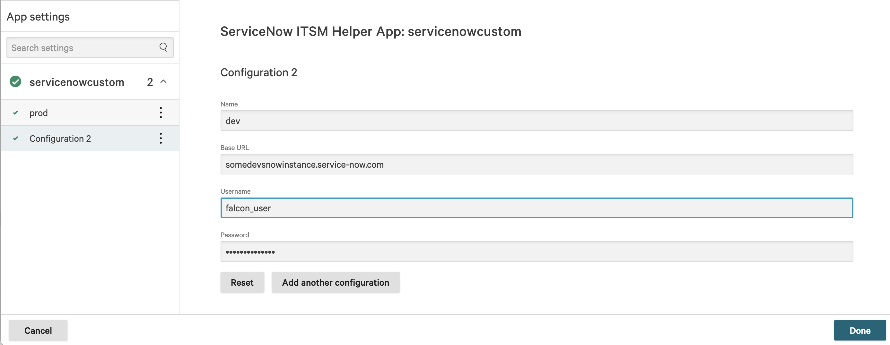
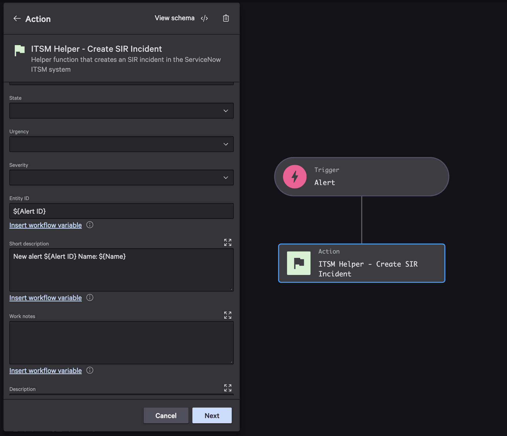
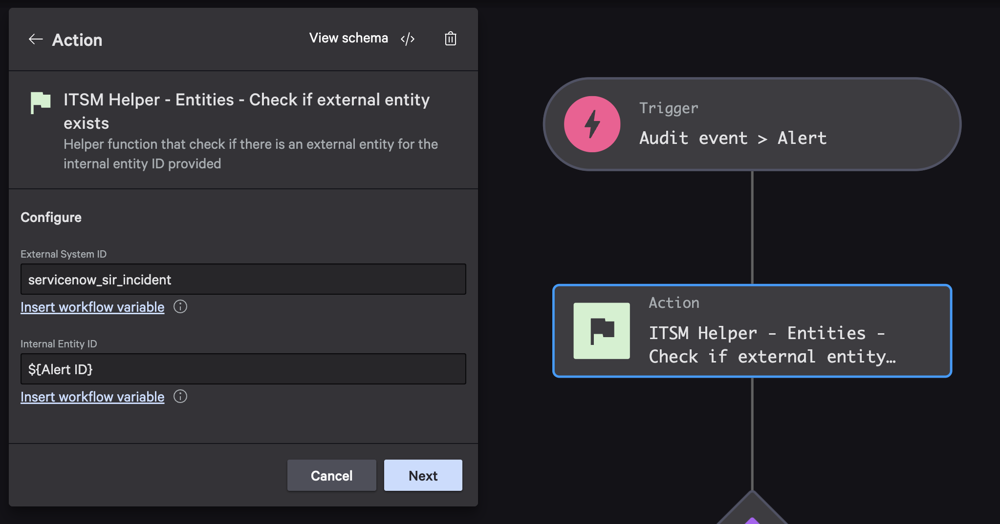
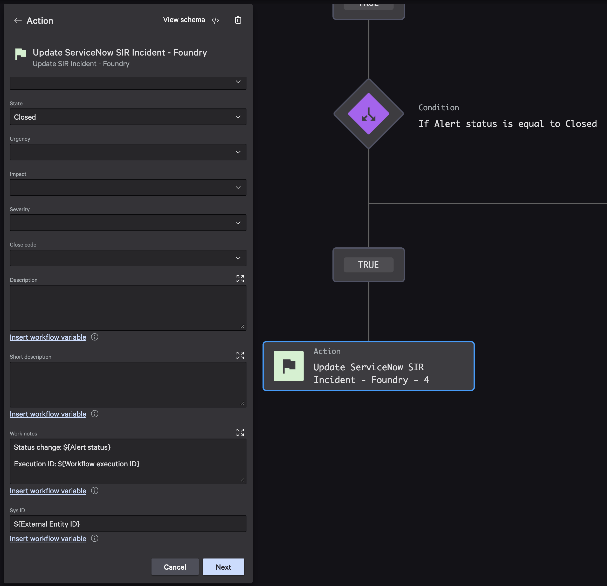
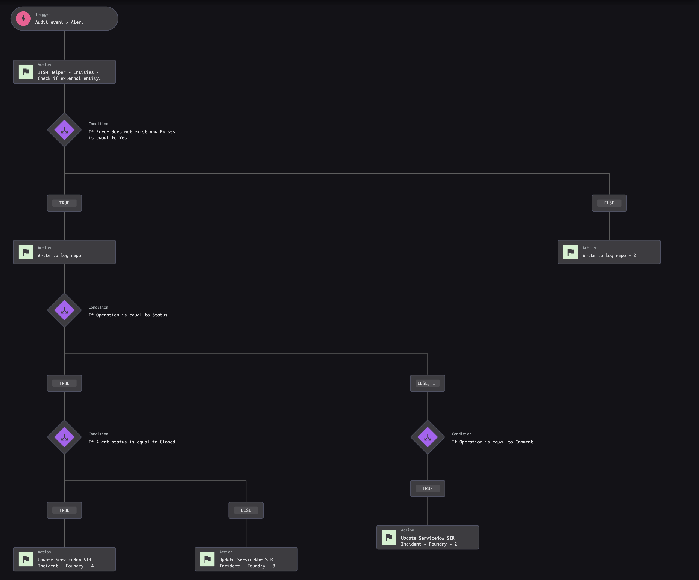
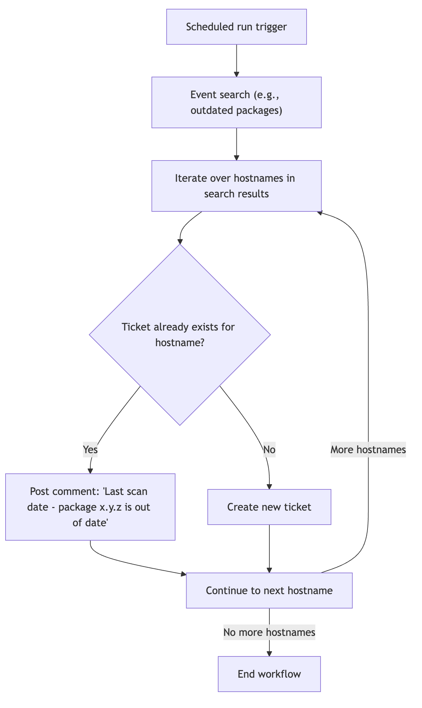
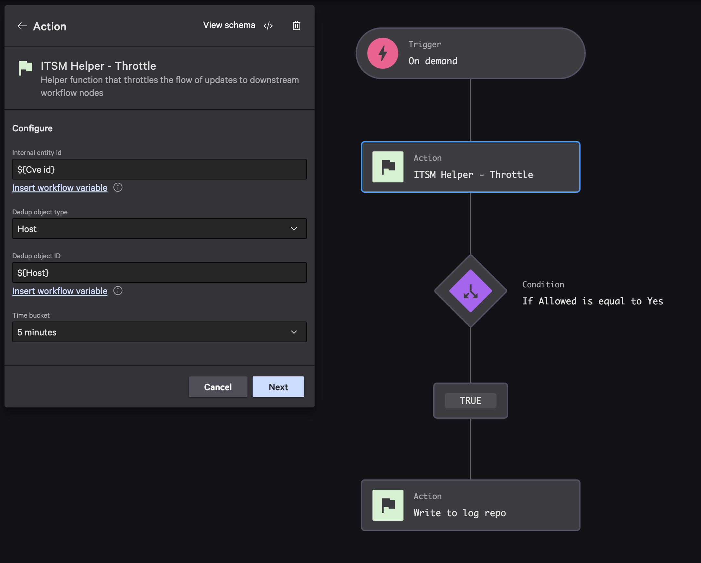
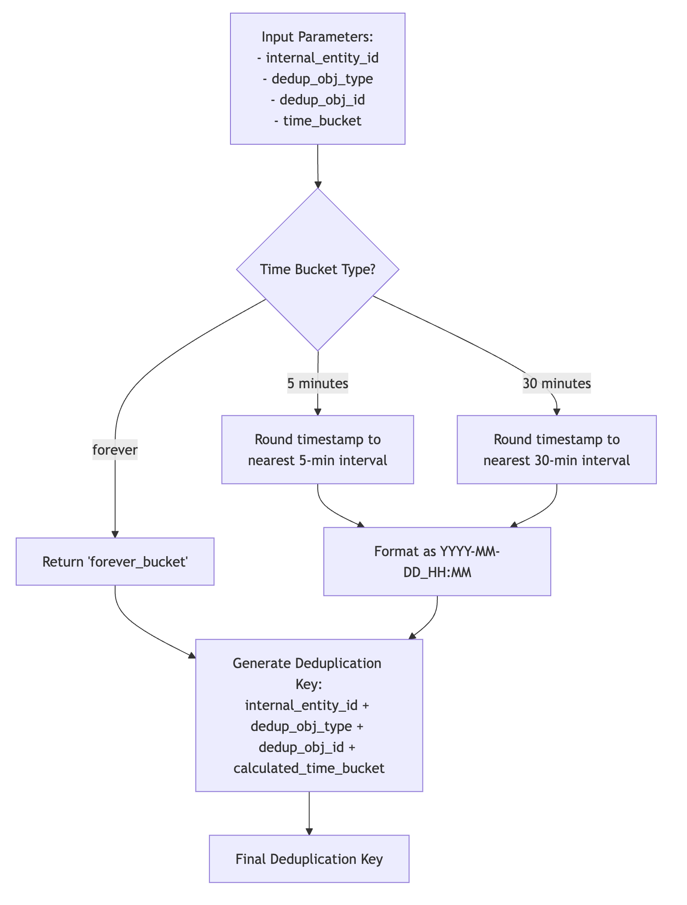
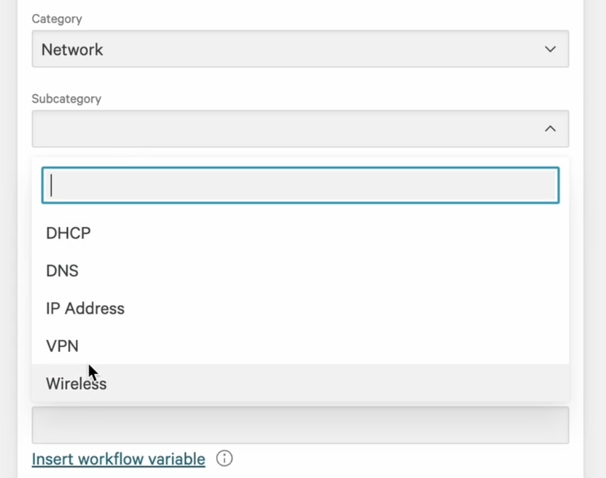

# User Documentation

## High-Level Overview

The ServiceNow ITSM and SIR is a Foundry application that enables seamless integration between CrowdStrike Falcon and ServiceNow IT Service Management (ITSM) systems. This integration allows security teams to efficiently manage incidents by automatically creating and updating ServiceNow tickets based on CrowdStrike detections and alerts.

The app provides a bridge between your security operations in CrowdStrike and your IT service management processes in ServiceNow, ensuring that security incidents are properly tracked, managed, and resolved through established ITSM workflows.

## Key Capabilities and Features

- **One-Way Alert Synchronization**: Automatically create ServiceNow incidents from CrowdStrike alerts
- **Entity Mapping**: Track relationships between CrowdStrike entities and ServiceNow tickets
- **Support for Multiple Ticket Types**: Create standard incidents or Security Incident Response (SIR) tickets
- **Ticket as a Container**: Associate multiple security objects (hosts, users, alerts) with a single ServiceNow ticket
- **Time-Based Throttling**: Control the flow of updates to prevent duplicate tickets and unnecessary noise
- **Customizable Fields**: Map CrowdStrike data to ServiceNow fields with support for custom fields and hierarchical categories

## Prerequisites and Requirements

Before using the ServiceNow ITSM and SIR app, ensure you have:

- A CrowdStrike Falcon instance with Foundry enabled
- A ServiceNow instance with ITSM module installed
- For SIR ticket functionality: ServiceNow Security Incident Response module
- API access to your ServiceNow instance
- Appropriate permissions in both CrowdStrike and ServiceNow

## ServiceNow Service Account Setup

### Step 1. Create a dedicated User Role
- Create a new role specifically for Falcon integration
- Suggested name: `falcon_user_role`
- This role will contain all necessary permissions for Falcon operations

### Step 2. Create a new ServiceNow User
- Create a new dedicated service account
- Assign the role created in Step 1 to this user
- Best practice: Use a descriptive User ID (e.g., `falcon_user`), and Name (e.g., "Falcon Integration")

### Step 3. Configure Required ACLs

The following ACLs must be created for the User Role from Step 1.

#### Required table access:
- `incident` (reads and writes) - allows Falcon to create incidents in ServiceNow
- `sn_si_incident` (reads and writes) - allows Falcon to create incidents in the ServiceNow Incident Response module (if your use-case needs it)
- `sys_user_group` (read-only) - allows Falcon to display a list of possible Assignment Groups in the UI
- `sys_choice.*` - allows Falcon to display ServiceNow incident configuration options like Priority, Impact, Urgency, and more

## Use Cases

### One-Way Alert Synchronization

#### Description of Alert Flow

The ServiceNow ITSM and SIR enables one-way synchronization of alerts from CrowdStrike to ServiceNow. When a security event is detected in CrowdStrike, the app can automatically create a corresponding ticket in ServiceNow, ensuring that security incidents are properly tracked in your ITSM system.



The workflow works as follows:

1. A security event is detected in CrowdStrike
2. The event triggers a workflow in Falcon Fusion (e.g., Alert trigger)
3. The workflow calls the ServiceNow ITSM and SIR app
4. The app checks if a ticket already exists for this entity
5. If no ticket exists, the app creates a new ticket in ServiceNow
6. The app stores the mapping between the CrowdStrike entity and the ServiceNow ticket

#### Configuration Steps

1. **Configure ServiceNow API Integration**:
   - Ensure the ServiceNow API integration is properly configured in your Foundry environment
   - Verify that the integration has the necessary credentials and permissions
   <br><br>

2. **Set Up Workflows**:
   - Create a workflow in Falcon Fusion that triggers on the desired security events
   - Add the appropriate ITSM Helper action to your workflow (Create Incident or Create SIR Incident)
   - Configure the action parameters, including:
     - `config_id`: The configuration ID for your ServiceNow integration
     - `entity_id`: The ID of the CrowdStrike entity (typically passed from the workflow trigger)
     - `short_description`: A brief description of the incident
     - Other optional fields like category, assignment group, etc.

   

#### Required Workflows

To implement alert synchronization, you'll need to create workflows that use the following ITSM Helper actions:

- **Check If External Entity Exists**: Checks if a ticket already exists for a given CrowdStrike entity
- **Create Incident** or **Create SIR Incident**: Creates a new ticket in ServiceNow

#### Alert Creation - Workflow

When creating alerts, the app supports various ServiceNow fields, including:

- Short description
- Description
- Assignment group
- Category
- Impact
- Severity
- State
- Urgency
- Work notes

You can customize these fields in your workflow to ensure that the created tickets contain all the necessary information.

#### Alert Updates - Separate Workflow

For existing alerts, a completely separate workflow from alert creation is used. This workflow is triggered specifically by "Audit Event > Alert" events and uses the ServiceNow API integration directly to update the ticket with new information. This can be done by:

1. Create a workflow in Falcon Fusion that triggers on Audit Event related to tracked entities (e.g., Alerts)
2. Using the "Check If External Entity Exists" action to get the ticket ID related to this entity (e.g., Alert)
   <br>
3. Using the ServiceNow API integration to update the ticket with the new information
   <br><br>
4. The complete alert update workflow overview:
   <br><br>


### Ticket as a Container for Security Objects

#### Overview of Consolidated Ticket Approach

The ServiceNow ITSM and SIR app allows you to use a single ServiceNow ticket as a container for multiple security objects. This approach provides a consolidated view of related security entities, making it easier to track and manage incidents that involve multiple hosts, users, or alerts.

Instead of creating separate tickets for each security object, you can associate all related objects with a single ticket, providing a more holistic view of the security incident.

#### How to Associate Multiple Objects with a Single Ticket

The app uses entity mapping to associate CrowdStrike entities with ServiceNow tickets. When you create a ticket for one entity, you can later associate additional entities with the same ticket by:

1. Using the "Check If External Entity Exists" action to see if any of the entities already have a ticket
2. If a ticket exists, using that ticket ID for all related entities
3. Creating entity mappings for each additional entity to the same ticket



#### Configuration Steps

1. **Identify Related Entities**:
   - Determine which CrowdStrike entities are related to the same incident
   - This could be based on common attributes, temporal proximity, or explicit relationships

2. **Check for Existing Tickets**:
   - Use the "Check If External Entity Exists" action for each entity
   - If any entity already has a ticket, use that ticket for all related entities

3. **Create Entity Mappings**:
   - For each entity that doesn't have a mapping, create a new mapping to the same ticket
   - Use the "Create Entity Mapping" action with:
     - `internal_entity_id`: The CrowdStrike entity ID
     - `external_entity_id`: The ServiceNow ticket ID
     - `external_system_id`: The identifier for the external system (e.g., "servicenow_incident", or "servicenow_sir_incident)

### Time-Based Throttling

#### Purpose and Benefits of Throttling

Time-based throttling helps control the flow of updates to ServiceNow, preventing duplicate tickets and reducing noise. This is particularly useful for:

- High-volume alert scenarios where multiple similar alerts might be generated
- Recurring issues that don't need a new ticket for each occurrence
- Reducing the load on your ServiceNow instance

By implementing throttling, you can ensure that your ServiceNow instance only receives actionable incidents, rather than being flooded with duplicate or closely related tickets.

#### Configuration Parameters

The throttling functionality is controlled by the following parameters:

- `internal_entity_id`: The identifier for the entity in CrowdStrike (e.g., CVE ID)
- `dedup_obj_type`: The type of object for deduplication (e.g., "Host", "User")
- `dedup_obj_id`: The ID of the specific object for deduplication
- `time_bucket`: The time period for deduplication ("forever", "5 minutes", "30 minutes")

#### Implementation Example

To implement throttling in your workflow:

1. Add the "Throttle" action before your ticket creation step
2. Configure the action with the appropriate parameters
3. Add a condition after the throttle action to check if further processing is allowed
4. Only proceed with ticket creation if the throttle action returns `allowed: true`

Example workflow logic:
```
1. Trigger on security event (e.g., CVE detected on a host)
2. Call Throttle action with appropriate parameters
3. Check if allowed == true
4. If allowed, proceed with ticket creation (or other notification action)
5. If not allowed, end workflow
```

Complete workflow example with throttling implementation:



#### Internal bucketing logic




## Advanced Configuration / FAQ

### Hierarchical Category Fields FAQ

ServiceNow often uses hierarchical category fields, where the selection in one field determines the available options in subsequent fields (like category and subcategory). The ServiceNow ITSM and SIR app supports this functionality.

#### How to Configure Dependent Fields

To implement dependent fields (like category/subcategory):

1. **Define API Endpoints for Both Fields**:
   - Create endpoints for both parent and dependent fields
   - Ensure the dependent field endpoint accepts a parameter for the parent value

2. **Configure Parent Field**:
   - Define the parent field with standard `x-cs-pivot` configuration
   - Ensure the referenced operation returns appropriate values

3. **Configure Dependent Field**:
   - Add `x-cs-condition-group-fields` to define dependency behavior
   - Configure `x-cs-pivot` with `queryString` to pass parent value

#### Sample Configuration



*Figure 8: ServiceNow UI showing hierarchical category fields in action*

Here's an example configuration for category and subcategory fields:

```json
// Field definitions in request schema (in functions/itsmhelper/schemas/create_incident_req_schema.json)
"category": {
  "title": "Category",
  "type": "string",
  "x-cs-pivot": {
    "entity": "plugins.proxy.425a02a359bd49ed92be2075a98898bc.get_category"
  }
},
"subcategory": {
  "title": "Subcategory",
  "type": "string",
  "x-cs-condition-group-fields": {
    "dependent_control": "config_id",
    "reset_fields": {
      "fields": [
        "config_id",
        "json.category"
      ]
    }
  },
  "x-cs-pivot": {
    "entity": "plugins.proxy.425a02a359bd49ed92be2075a98898bc.get_subcategory",
    "queryString": "params.query.dependent_value=~json.category~"
  }
}

// API endpoint definitions (in api-integrations/servicenow.json)
"/api/now/table/sys_choice?element=subcategory&name=incident": {
  "get": {
    "operationId": "get_subcategory",
    "parameters": [
      {
        "in": "query",
        "name": "sysparm_fields",
        "schema": {
          "default": "label,value,sys_id",
          "type": "string"
        }
      },
      {
        "in": "query",
        "name": "dependent_value"
      }
    ],
    "x-cs-operation-config": {
      "autocomplete": {
        "display_field": "label",
        "id_field": "value",
        "iterable_path": "result"
      }
    }
  }
}
```

#### Key Components

- **Parent field**: Standard field with x-cs-pivot
- **Dependent field**: 
  - `x-cs-condition-group-fields`: Defines dependency behavior
  - `reset_fields`: Lists fields to reset when parent changes
  - `queryString`: Passes parent value to dependent endpoint
- **Dependent endpoint**: Must accept `dependent_value` parameter
- **Response schema**: Must include fields referenced in autocomplete config
  - Typically includes `label` (display text), `value` (stored value), and `sys_id`

When implemented correctly, selecting a value in the parent field will automatically update the available options in the dependent field, creating a dynamic form experience that matches ServiceNow's native behavior.

### Adding Custom ServiceNow Fields

ServiceNow often includes custom fields (prefixed with "u_" or "x_") that are specific to an organization's implementation. The ServiceNow ITSM and SIR app provides two approaches to incorporate these custom fields:

1. **Using the "Custom Fields JSON (advanced)" parameter**: Pass any custom fields as a JSON string without modifying the app
   ```json
   {
     "u_custom_field1": "value1",
     "u_affected_systems": 3
   }
   ```

2. **Adding individual custom fields to the schema**: Define specific fields with their own UI elements

Choose the first approach for flexibility and simplicity, especially for dynamic fields or when you can't modify the app. Use the second approach when you need dedicated UI elements, validation or autocomplete for specific custom fields.

#### Step-by-Step Process for Adding Individual Custom Fields

1. **Identify the Custom Field in ServiceNow**:
   - Determine the API name of the custom field in ServiceNow (usually prefixed with "u_")
   - Identify the field type (string, number, boolean, choice list, etc.)
   - For choice list fields, determine how to retrieve the available options

2. **Update the API Integration Definition**:
   - Modify the ServiceNow API integration JSON file (`api-integrations/servicenow.json`)
   - Add the custom field to the appropriate request schema (incident or sn_si_incident)
   - For choice list fields, add a corresponding endpoint to retrieve the available options

3. **Update the Request Schema Files**:
   - Add the custom field to the appropriate schema file:
     - `functions/itsmhelper/schemas/create_incident_req_schema.json` for regular incidents
     - `functions/itsmhelper/schemas/create_sir_incident_req_schema.json` for SIR incidents
   - Include the field in the `x-cs-order` array to control its position in the UI

4. **Deploy the Updated Integration**:
   - Deploy the updated app to your Foundry environment
   - Test the integration to ensure the custom fields work as expected

#### Example: Adding a Simple Text Field

For a simple text field like "u_custom_text_field":

1. **In the API Integration JSON**:
```json
"u_custom_text_field": {
  "title": "Custom Text Field",
  "type": "string"
}
```

2. **In the Request Schema File**:
```json
"u_custom_text_field": {
  "title": "Custom Text Field",
  "type": "string"
}
```

3. **Add to x-cs-order Array**:
```json
"x-cs-order": [
  "config_id",
  "entity_id",
  "short_description",
  "u_custom_text_field",
  ...
]
```

#### Example: Adding a Field with Dropdown Values

For a field with predefined values like "u_custom_choice_field":

1. **In the API Integration JSON - Define the Field**:
```json
"u_custom_choice_field": {
  "title": "Custom Choice Field",
  "type": "string",
  "x-cs-pivot": {
    "entity": "plugins.proxy.425a02a359bd49ed92be2075a98898bc.get_custom_choice_values"
  }
}
```

2. **In the API Integration JSON - Define the Endpoint**:
```json
"/api/now/table/sys_choice?element=u_custom_choice_field&name=incident": {
  "get": {
    "operationId": "get_custom_choice_values",
    "parameters": [
      {
        "in": "query",
        "name": "sysparm_fields",
        "schema": {
          "default": "label,value,sys_id",
          "type": "string"
        }
      }
    ],
    "x-cs-operation-config": {
      "autocomplete": {
        "display_field": "label",
        "id_field": "value",
        "iterable_path": "result"
      }
    }
  }
}
```

3. **In the Request Schema File**:
```json
"u_custom_choice_field": {
  "title": "Custom Choice Field",
  "type": "string",
  "x-cs-pivot": {
    "entity": "plugins.proxy.425a02a359bd49ed92be2075a98898bc.get_custom_choice_values"
  }
}
```

#### Field Mapping Guidelines

When mapping fields from CrowdStrike to ServiceNow:

- **Field Names**: Always use the exact API field name from ServiceNow
- **Field Types**: Ensure the field type in your definition matches the ServiceNow field type
- **Required Fields**: If the field is required in ServiceNow, add it to the `required` array
- **Reference Fields**: For fields that reference other tables (like assignment group), use the sys_id value
- **Choice Fields**: For choice fields, use the value rather than the display name

#### Autocomplete for Custom Fields

To enable autocomplete for custom fields that reference other ServiceNow tables:

1. Add the `x-cs-pivot` property to your field definition
2. Configure the `entity` property to point to the appropriate API operation
3. Set `searchable` to `true` if you want to enable search functionality

Example:
```json
"u_custom_field": {
  "title": "Custom Field",
  "type": "string",
  "x-cs-pivot": {
    "entity": "plugins.proxy.425a02a359bd49ed92be2075a98898bc.get_custom_table",
    "searchable": true
  }
}
```

This configuration will allow users to select values from the custom table when configuring the workflow action.

### OAuth 2.0 Client Credentials configuration

This application support both Basic Auth and OAuth 2.0 Client Credentials grant.

#### Prerequisites
- **Set system property**: `glide.oauth.inbound.client.credential.grant_type.enabled` = `true`. This property enables "Client Credentials" grant type in ServiceNow ([reference](https://support.servicenow.com/kb?id=kb_article_view&sysparm_article=KB1645212)).

#### Creating OAuth Client
1. Navigate to **System OAuth → Application Registry**
2. Choose **Create an OAuth API endpoint for external clients**
3. Complete required fields (Redirect URL and Login URL not needed)
4. Add **OAuth Application User** field to the form
5. **Assign a service account** to the OAuth Application User field
